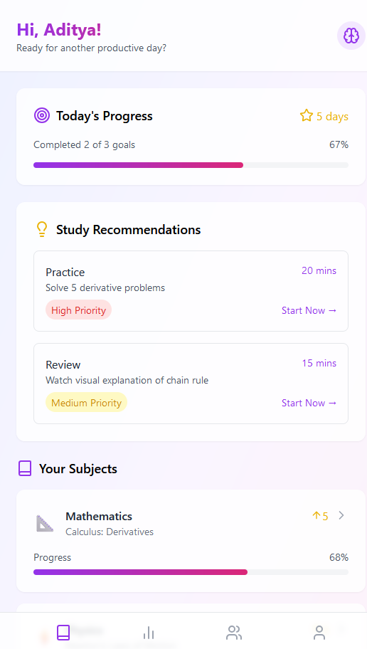

# Smart Study Buddy - PROTOTYPE

Smart Study Buddy is a responsive web application built using **React**, **Vite**, and **Tailwind CSS**. It provides a mobile-like experience using `react-native-web` and includes custom animations for an engaging UI.

---

## Features

- Responsive and mobile-friendly design.
- Custom animations using Tailwind's `@keyframes`.
- Dark mode support.
- Built for performance using Vite.

---

## Prerequisites

Before you begin, ensure you have the following installed:

- **Node.js** (v16 or later): [Download Node.js](https://nodejs.org/)
- A package manager like **npm** (comes with Node.js) or **yarn**.

---

## Installation and Setup

1. **Clone the repository**:
   ```bash
   git clone https://github.com/Ady-6720/AIStudyBuddy.git
   cd AIStudyBuddy
   ```

2. **Install dependencies**:
   ```bash
   npm install
   ```

3. **Run the development server**:
   ```bash
   npm run dev
   ```

4. Open the app in your browser at:
   ```
   http://localhost:5173
   ```

---

## Build for Production

To create an optimized production build:
```bash
npm run build
```

---

## Preview Production Build

To preview the production build locally:
```bash
npm run preview
```

---

## Required Libraries

If any libraries are missing or need to be re-installed, run:
```bash
npm install react react-dom tailwindcss postcss autoprefixer vite
npm install react-native-web lucide-react
```

---

## Project Structure

```plaintext
├── src/
│   ├── components/    # Reusable React components
│   ├── styles/        # Tailwind and custom styles
│   └── App.jsx        # Main application entry point
├── public/
│   └── index.html     # Root HTML file
├── tailwind.config.js # Tailwind configuration
├── vite.config.js     # Vite configuration
├── package.json       # Project dependencies and scripts
└── README.md          # Documentation
```

---

## Screenshots

### Home Page


### Dark Mode


---

## Contributing

Contributions are welcome! Follow these steps:

1. **Fork this repository**.
2. Create a new branch for your feature:
   ```bash
   git checkout -b feature/your-feature-name
   ```
3. Commit your changes:
   ```bash
   git commit -m "Add your feature description"
   ```
4. Push to your fork:
   ```bash
   git push origin feature/your-feature-name
   ```
5. Open a pull request on the main repository.

---

## License

This project is licensed under the MIT License. See the `LICENSE` file for details.

---

## Acknowledgements

Thanks to all contributors and the open-source community for providing tools and inspiration.

